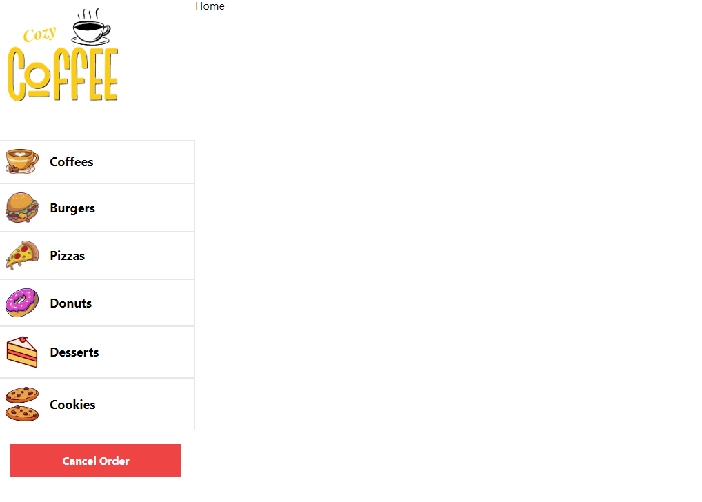

# _COZY COFFEE_

- **Description :**

  CozyCoffee is your one-stop platform for quick and delicious food orders, ranging from mouthwatering desserts to scrumptious pizzas and burgers. With a diverse menu that caters to every craving, we offer a seamless experience for ordering your favorite fast food. Our user-friendly platform ensures a hassle-free selection and customization of your order, bringing the comfort of your favorite treats right to your doorstep. Explore a world of flavors with CozyCoffee and elevate your dining experience with just a few clicks.

---

- **Installation Requirements :**

  - **Composer**
  - **Node.js**
  - **XAMPP**
  - **Activate Zip at PHP.ini**

---

- **Installation Instructions :**

  **1. composer install `cozy-coffee/laravel-cozy-coffee`** 
  **2. npm install `cozy-coffee/react-cozy-coffee`** 
  **3. Create DIR `cozy-coffee/laravel-cozy-coffee/bootstrap/cache`** 
  **4. Create DB** 
  **5. Config `cozy-coffee/laravel-cozy-coffee/.env`** 
  **6. php artisan migrate `cozy-coffee/laravel-cozy-coffee`** 
  **7. npm run dev `cozy-coffee/react-cozy-coffe`** 

---

- **Stack :**

  - **Vite** : `4.0.0`
  - **React** : `18.2.0`
  - **Laravel** : `10.42.0`
  - **TailwindCSS** : `3.4.1`
  - **React-Router-Dom** : `6.21.3`

---

- **Credits :**

  - **Author : [David Gómez](https://github.com/DavidGomezToca)**
